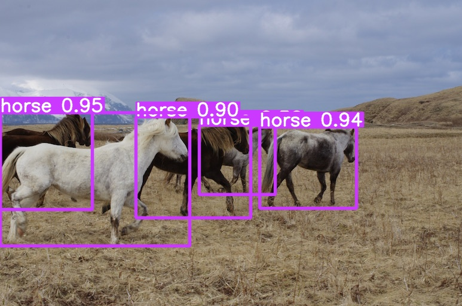

# LVA RV: Object detection in a cluttered kitchen setting - YOLOv9 implementation

Implementation of paper - [YOLOv9: Learning What You Want to Learn Using Programmable Gradient Information](https://arxiv.org/abs/2402.13616)
## YOLOv9 implementation
This is a fork of the [YOLOv9 implementation by WongKinYiu](https://github.com/WongKinYiu/yolov9) 
#### Performance on MS COCO
| Model | Test Size | AP<sup>val</sup> | AP<sub>50</sub><sup>val</sup> | AP<sub>75</sub><sup>val</sup> | Param. | FLOPs |
| :-- | :-: | :-: | :-: | :-: | :-: | :-: |
| [**YOLOv9-T**]() | 640 | **38.3%** | **53.1%** | **41.3%** | **2.0M** | **7.7G** |
| [**YOLOv9-S**]() | 640 | **46.8%** | **63.4%** | **50.7%** | **7.1M** | **26.4G** |
| [**YOLOv9-M**]() | 640 | **51.4%** | **68.1%** | **56.1%** | **20.0M** | **76.3G** |
| [**YOLOv9-C**](https://github.com/WongKinYiu/yolov9/releases/download/v0.1/yolov9-c-converted.pt) | 640 | **53.0%** | **70.2%** | **57.8%** | **25.3M** | **102.1G** |
| [**YOLOv9-E**](https://github.com/WongKinYiu/yolov9/releases/download/v0.1/yolov9-e-converted.pt) | 640 | **55.6%** | **72.8%** | **60.6%** | **57.3M** | **189.0G** |

## Weights & Evaluation

The weights can be downloaded here:

[`yolov9-c-converted.pt`](https://github.com/WongKinYiu/yolov9/releases/download/v0.1/yolov9-c-converted.pt)

[`yolov9-e-converted.pt`](https://github.com/WongKinYiu/yolov9/releases/download/v0.1/yolov9-e-converted.pt)

[`yolov9-c.pt`](https://github.com/WongKinYiu/yolov9/releases/download/v0.1/yolov9-c.pt)

[`yolov9-e.pt`](https://github.com/WongKinYiu/yolov9/releases/download/v0.1/yolov9-e.pt)

[`gelan-c.pt`](https://github.com/WongKinYiu/yolov9/releases/download/v0.1/gelan-c.pt)

[`gelan-e.pt`](https://github.com/WongKinYiu/yolov9/releases/download/v0.1/gelan-e.pt)

[`self trained weights: full-train.pt & frozen.pt`](https://tuwienacat-my.sharepoint.com/:u:/g/personal/e11730467_student_tuwien_ac_at/EaW4pUU4Fj1OqwoDNwq3KacBIt9xG_h-ZGem4e_1zBR7bQ?e=Yx1wCY)

``` shell
# evaluate converted yolov9 models
python val.py --data data/coco.yaml --img 640 --batch 32 --conf 0.001 --iou 0.7 --device 0 --weights './yolov9-c-converted.pt' --save-json --name yolov9_c_c_640_val

# evaluate yolov9 models
python val_dual.py --data data/coco.yaml --img 640 --batch 32 --conf 0.001 --iou 0.7 --device 0 --weights './yolov9-c.pt' --save-json --name yolov9_c_640_val

# evaluate gelan models
python val.py --data data/coco.yaml --img 640 --batch 32 --conf 0.001 --iou 0.7 --device 0 --weights './gelan-c.pt' --save-json --name gelan_c_640_val
```
## Detection

<div align="center">
    <a href="./">
        
    </a>
</div>

``` shell
# inference converted yolov9 models
python detect.py --source './data/images/horses.jpg' --img 640 --device 0 --weights './yolov9-c-converted.pt' --name yolov9_c_c_640_detect

# inference yolov9 models
# python detect_dual.py --source './data/images/horses.jpg' --img 640 --device 0 --weights './yolov9-c.pt' --name yolov9_c_640_detect

# inference gelan models
# python detect.py --source './data/images/horses.jpg' --img 640 --device 0 --weights './gelan-c.pt' --name gelan_c_c_640_detect
```
# Setup
1. Make sure that GPU is [cuda capable](https://developer.nvidia.com/cuda-gpus)
1. Install [CUDA Toolkit](https://developer.nvidia.com/cuda-downloads)
1. (Optional? - not sure) Install [CUDNN Library](https://developer.nvidia.com/cudnn-downloads)
1. Restart pc
1. Create an environment in your local repository (see section VENV usage) but do not yet install all requirements
1. Install [Pytorch locally](https://pytorch.org/get-started/locally/) by running 
    ```
        pip3 install torch torchvision torchaudio --index-url https://download.pytorch.org/whl/cu118
    ```
    If allready installed use  
    ```
        pip3 install --upgrade --force-reinstall torch torchvision torchaudio --index-url https://download.pytorch.org/whl/cu118
    ```
1. Setup the rest of the environment
1. Check if Torch&Cuda detect your GPU correctly with TorchTest.py
1. (Optional) run scripts/get_coco.sh to download the COCO dataset before validation (~20gb!)
1. (Optional) Download Yolo-models linked in [Evaluation](#weights--evaluation), run validation as mentioned and compare results 
1. (Optional) Detection can be done by using the image folder path instead of './data/images/horses.jpg' in [Detection](#detection) 

    
## VENV usage
To install the required packages into an environment use following commands **after navigating to your local git repository** in CMD:
Before the installation of the packages, [Python](https://www.python.org/downloads/) and [MS Visual C++ build tools(>= V14.0)](https://visualstudio.microsoft.com/de/downloads/?q=build+tools) have to be installed.

Step 1: Creating a VENV environment in the directory
```
YOUR_PYTHON_PATH\python.exe -m venv .env
```
Step 2: Activating it
```
.env\scripts\activate.bat
```
The Environment should now be activated and CMD should look like 
```
(.env) YOUR_REPOSITORY_PATH\yolov9>
```
Step 3: Now you can install the nessecary packages specified in "requirements.txt" with
```
pip install -r requirements.txt
``` 

VSCode should now automatically detect the environment and suggest using it as the python interpreter.


## LVIS installation

get lvis.yaml [https://docs.ultralytics.com/de/datasets/detect/lvis/#applications](https://docs.ultralytics.com/de/datasets/detect/lvis/#applications)

run 

```
pip install ultralytics
```
and then 
```
from ultralytics.utils.downloads import download
from pathlib import Path

# Download labels
dir = Path('.\LVIS')  # dataset root dir

```
check path, afterwards
```
url = 'https://github.com/ultralytics/yolov5/releases/download/v1.0/'
urls = [url + 'lvis-labels-segments.zip']  # labels
download(urls, dir=dir.parent)
# Download data
urls = ['http://images.cocodataset.org/zips/train2017.zip',  # 19G, 118k images
        'http://images.cocodataset.org/zips/val2017.zip',  # 1G, 5k images
        'http://images.cocodataset.org/zips/test2017.zip']  # 7G, 41k images (optional)
download(urls, dir=dir / 'images', threads=3)
```


